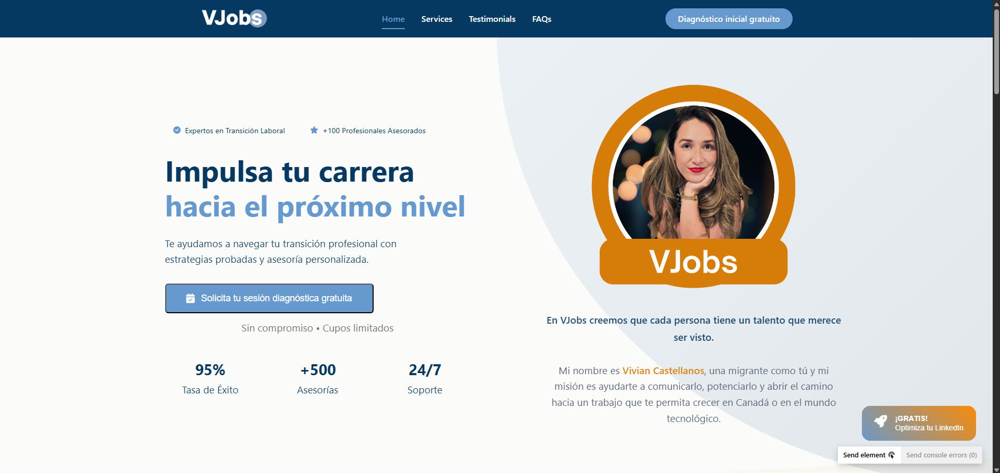
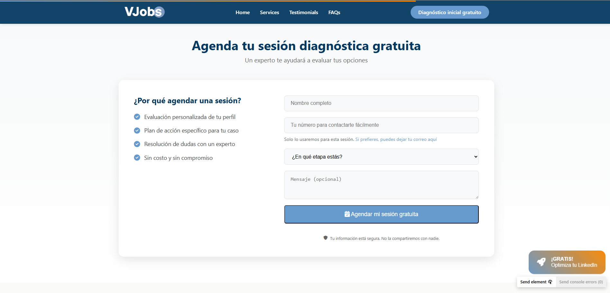
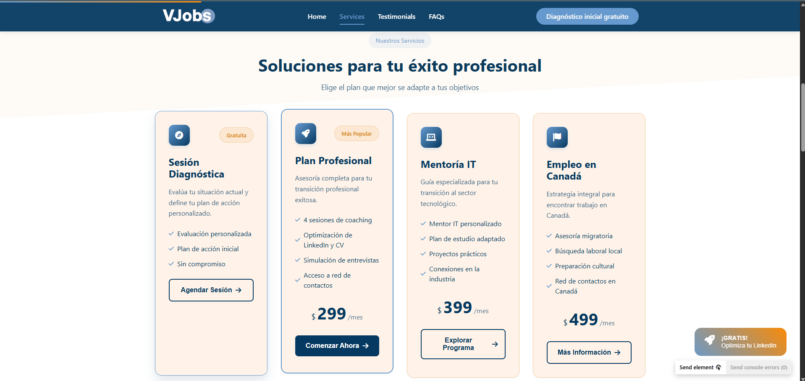
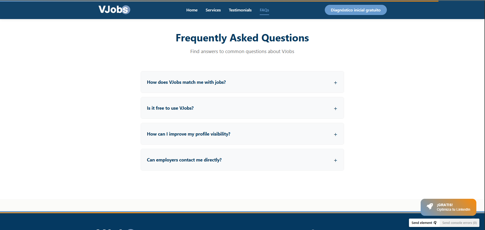
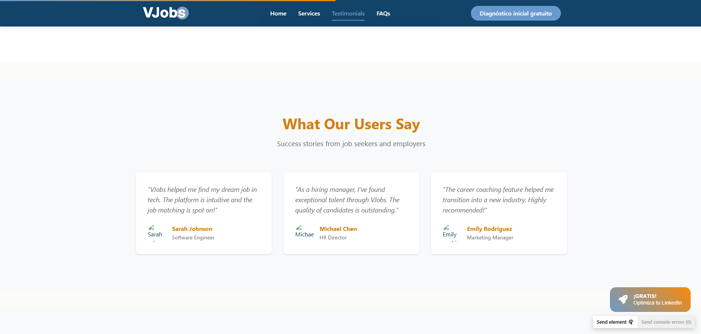
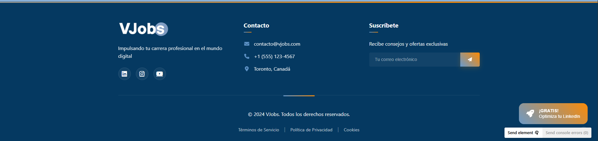

# VJobs Landing Page

## Overview
Professional landing page designed to convert visitors into leads and present VJobs' career development services in Canada. The page guides visitors through a strategic journey that highlights service value and facilitates conversion through multiple touchpoints.

## Business Goals
1. **Lead Generation**: Capture contact information from professionals interested in career development services in Canada
2. **Service Sales**: Convert visitors into clients by clearly presenting our professional advisory services

## Core Features
1. **Contact Strategy**:
   * Strategic contact form placement
   * Floating lead magnet
   * Multiple CTAs
   * Email automation system

2. **Service Showcase**:
   * Career Advisory in Canada
   * LinkedIn Profile Optimization
   * Interview Preparation
   * CV Enhancement

3. **Lead Magnet**:
   * LinkedIn optimization guide
   * Automated email delivery
   * Value-first approach
   * Clear conversion path

## Tech Stack

### Core Technologies
* **Frontend**: 
  * Vue 3 (Composition API)
  * Vue Router for navigation
  * Vite for development

### UI/UX
* **Styling**: 
  * Component-scoped CSS
  * CSS Variables for theming
  * Custom animations
  * Font Awesome icons

* **Components**:
  * Custom-built UI components
  * Responsive design
  * No external UI libraries

### Features & Integration
* **Forms**: 
  * Custom validation
  * Email/phone toggle
  * Brevo API integration

* **Automation**:
  * Lead magnet delivery
  * Email response system
  * Contact management

### Infrastructure
* **Deployment**: 
  * Vercel hosting
  * Serverless functions
  * Environment-based config

## Project Structure
```
src/
├── assets/        # Static assets and global CSS
├── components/    # Reusable Vue components
│   ├── forms/     # Form components
│   ├── sections/  # Page sections
│   └── ui/        # UI elements
├── views/         # Page components
└── App.vue        # Root component
```

## Development

### Prerequisites
* Node.js 16+
* npm or yarn
* Code editor with Vue support

### Quick Start
```bash
# Install dependencies
npm install

# Start development server
npm run dev

# Build for production
npm run build
```

### Environment Setup
1. Copy `.env.example` to `.env`
2. Add Brevo API key
3. Configure deployment settings

## 🚀 Development Roadmap

### Short Term (Sprint 1-2)
* Configure serverless functions for API security
* Implement form validation
* Test responsive design
* Set up conversion tracking

### Medium Term (Sprint 3-4)
* Implement email automation flow
* Create post-download thank you page
* Enhance responsive experience
* Add analytics dashboard

### Future Enhancements
* Live chat integration
* Admin dashboard
* Additional lead magnets
* A/B testing implementation

## Additional Documentation
* [Brevo API Docs](https://developers.brevo.com/reference/getting-started-1)
* [Vue 3 Guide](https://vuejs.org/guide/introduction.html)
* [Vercel Deployment](https://vercel.com/docs)

---

## Page Structure

### 1. Navbar
* Fixed top navigation
* Animated scroll progress
* Main CTA button

### 2. Hero Section
* Engaging headline
* Value proposition
* Primary CTA

### 3. Services Showcase
* Service cards
* Icons and descriptions
* Learn more buttons

### 4. Contact Section
* Contact form
* Business information
* Social links

### 5. Footer
* Navigation links
* Copyright
* Legal information

---

## Technical Notes

### Key Dependencies
* Vue.js 3
* Vite
* Vue Router
* Font Awesome

---

## Style Guide

### Color Palette
- **Primary**: #0056b3 (Corporate blue)
- **Secondary**: #ff6b00 (Action orange)
- **Backgrounds**: #ffffff (White)
- **Text**: #333333 (Dark gray)

### Typography
- **Headings**: 'Poppins', sans-serif
- **Body**: 'Open Sans', sans-serif

### Key Components
- Home Section 
- Contact Form 
- Services Section 
- FAQ Section 
- Testimonials 
- Footer 

Each component follows the established color palette and typography guidelines while maintaining consistent spacing and alignment throughout the interface.

---